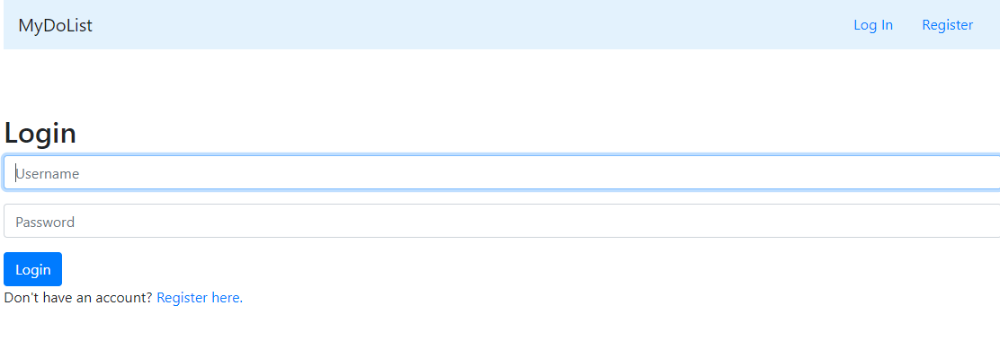
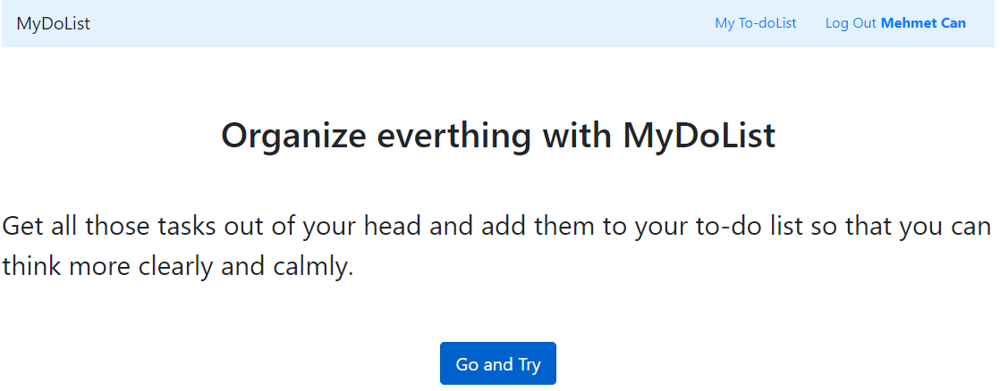
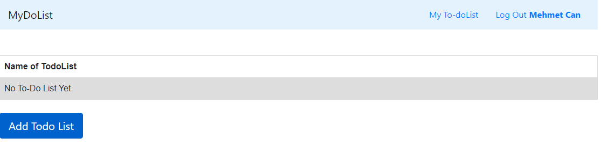
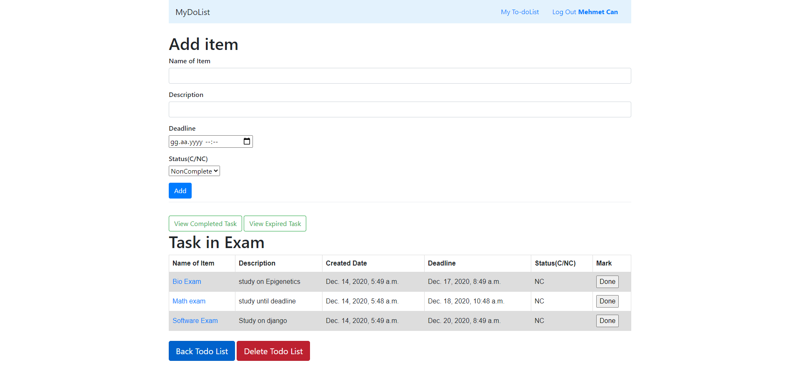

# Django-To-Do-App
To-do app with python, django, django orm

# Django-Todo-App
Todo app with python, django, django orm

# MyDoList
It is app that you can create a user specific to-do list and item. You can give  a name, description, deadline, and status to any item. You can filter to-do items (status complete or not, expired, name) on a to-do list. To-item ordered by name.

# Getting Started

* Download the distribution code.
* In your terminal, cd into the **Django-Todo-App directory**.
* Run **python manage.py makemigrations todo** to make migrations for the todo app.
* Run **python manage.py migrate** to apply migrations to your database.

# Requirements
* Django
* python version 3.6 or above

# Understanding

* In the distribution code is a Django project called todo that contains a single app called todo.
* You  can open up todo/urls.py, where the URL configuration for this app is defined. 
* Open up todo/views.py, where all the logic for this app is defined. 
* Open up todo/models.py, there is three class in models.py, User model inherits from Abstract user. Dolist models have many to one and many to many relationship with User and Item model. 

## You can register and login

## Click go and try button

## Click add to-do list button

## In to-do list click your list item and start to add item, you can filter item as you want

